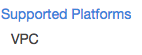
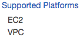

# Account Setup

This page covers making sure your AWS account is compatible with and correctly configured for Datomic Cloud. Once you have performed these steps, you can start any number of systems in regions that support Datomic.

- [EC2 key pair](#ec2-key-pair)
- [Verify region is EC2-VPC only](#verify-region-is-ec2-vpc-only)
- [Supported regions](#supported-regions)

## EC2 Key Pair

It is required to associate an EC2 key pair with [EC2 instances](../../../05-operation/02-cloud/01-cloud-architecture/cloud-architecture.md#nodes) launched by Datomic. This keypair is never used by Datomic itself, and by default SSH ingress is disabled. The key pair is available in case an operator wants to deliberately open SSH ingress and log into boxes.

If you do not already have an EC2 Key Pair, create one from the [EC2 Key Pair console](https://console.aws.amazon.com/ec2/v2/home?#KeyPairs) by following these steps:

1. Click the "Create key pair" button.
2. Enter a name for your new key pair. Take note of this name – you will need it when you [start a system](../02-cloud-setup/cloud-setup.md).
3. Press the "Create" button.
4. Save the downloaded certificate (.pem) file for later use.
5. From a Terminal window run:

   `chmod 400 <path-to-your-pem-file>`

   Replacing `<path-to-your-pem-file>` with the path to the .pem file you downloaded in step 4.

## Verify Region is EC2-VPC Only

Datomic Cloud requires an AWS account that supports only EC2-VPC. All accounts created after Dec 4, 2013 support EC2-VPC. If you have an older account, EC2-VPC support can be verified [using the AWS CLI](#cli-verification-method) or [the AWS web GUI](#gui-verification-method).

If your target regions are EC2-Classic only, then there are two options for using Datomic:

- Create a new account. You can associate it with your existing account(s) using [AWS consolidated billing for organizations](http://docs.aws.amazon.com/awsaccountbilling/latest/aboutv2/consolidated-billing.html).
  - To use consolidated billing, you must either have or [create an organization](http://docs.aws.amazon.com/organizations/latest/userguide/orgs_manage_org.html).
- You may then either [associate existing accounts with it](http://docs.aws.amazon.com/organizations/latest/userguide/orgs_manage_accounts_invites.html) or [create a new one](http://docs.aws.amazon.com/organizations/latest/userguide/orgs_manage_accounts_create.html).
- [Migrate your account](https://docs.amazonaws.cn/en_us/AWSEC2/latest/UserGuide/vpc-migrate.html#convert-ec2-classic-account) if it's possible to delete all EC2-Classic resources in that region.

### CLI Verification Method

If you have [the AWS CLI](https://aws.amazon.com/cli/) installed and [appropriate credentials](https://docs.aws.amazon.com/cli/latest/userguide/cli-configure-files.html), you can use the following command:

```sh
aws ec2 describe-account-attributes --attribute-names supported-platforms --region <region>
```

Where `<region>` is the region to check the supported platforms.

An account that's EC2-Classic only will return a response where the `AttributeValue` keys are "EC2" _and_ "VPC".

An account that supports EC2-VPC will return only a "VPC" `AttributeValue`.

### GUI Verification Method

Ensure that the correct region is selected in the upper right-hand corner of the AWS web GUI. Then follow the steps below:

1. Open the [Amazon EC2 console](https://console.aws.amazon.com/ec2/v2/home).
2. Use the navigation bar in the upper right to choose the region in which you will run Datomic.
3. On the Amazon EC2 console dashboard, look for "Supported platforms" under "Account attributes".
   - If you see only "VPC", your region is EC2-VPC only, and you can run Datomic in this region.

   

   - If you see "EC2" listed under "Supported platforms" (even if you also see "VPC"), then this region is EC2-Classic, and you cannot run Datomic in this region at this time.

   

   If the region you checked is an EC2-Classic region, one of your other regions might still be an EC2-VPC-only region, if you didn't use that region before Dec 4, 2013. Follow the above instructions to check in the other supported regions.

## Supported Regions

Datomic Cloud currently runs in the following AWS regions:

- us-east-1
- us-east-2
- us-west-2
- ca-central-1
- eu-central-1
- ap-southeast-1
- ap-southeast-2
- ap-northeast-1
- ap-south-1
- sa-east-1
- eu-west-1
- eu-west-2
- eu-north-1

If you are unfamiliar with AWS region codes, you can [review available AWS region codes here](https://docs.aws.amazon.com/AWSEC2/latest/UserGuide/using-regions-availability-zones.html#concepts-available-regions).

If you are interested in a region not shown here, please contact [Datomic support](https://www.datomic.com/support.html).
